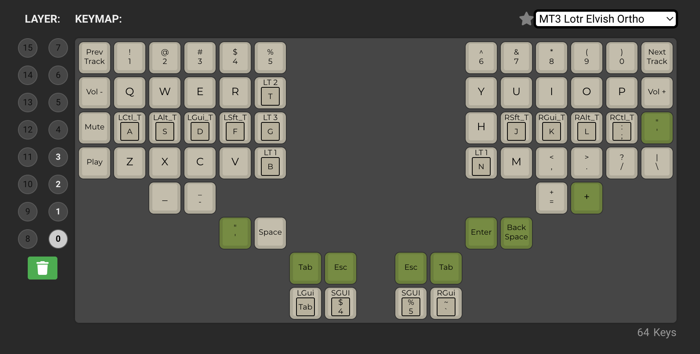
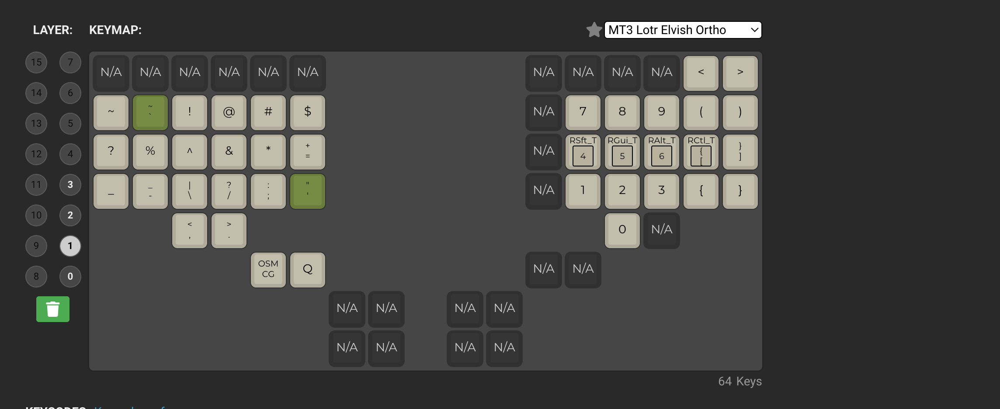
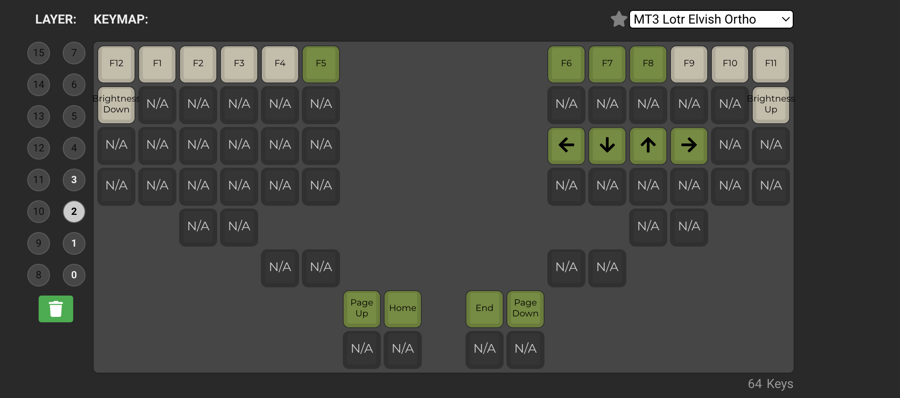
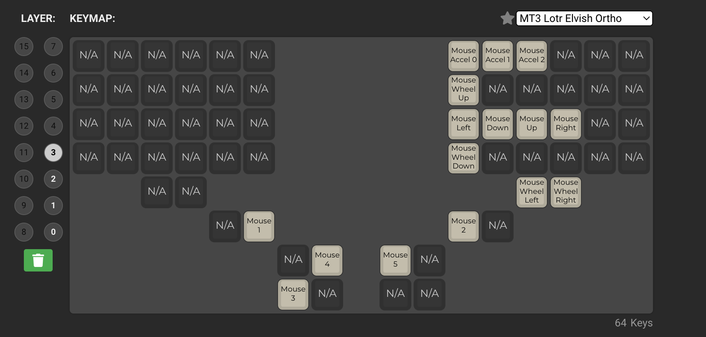

# Detailed guide on how to build your first Dactyl Manuform keyboard

This is a repo for the blog: https://medium.com/@dkojovic/detailed-guide-on-how-to-build-your-first-dactyl-manuform-keyboard-a412630de76f
Check out the blog for detailed explanation of the whole build process.

### Finished keyboard

### Full diagram for the keyboard

### List of parts

Full list of parts can be found in the [parts](/parts) folder

### My layout

#### Layer 0:

#### Layer 1:

#### Layer 2:

#### Layer 3 (mouse keys):

