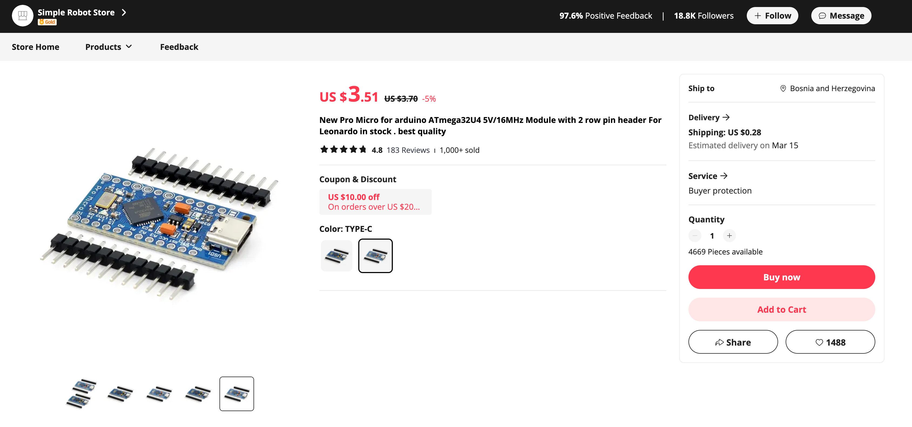
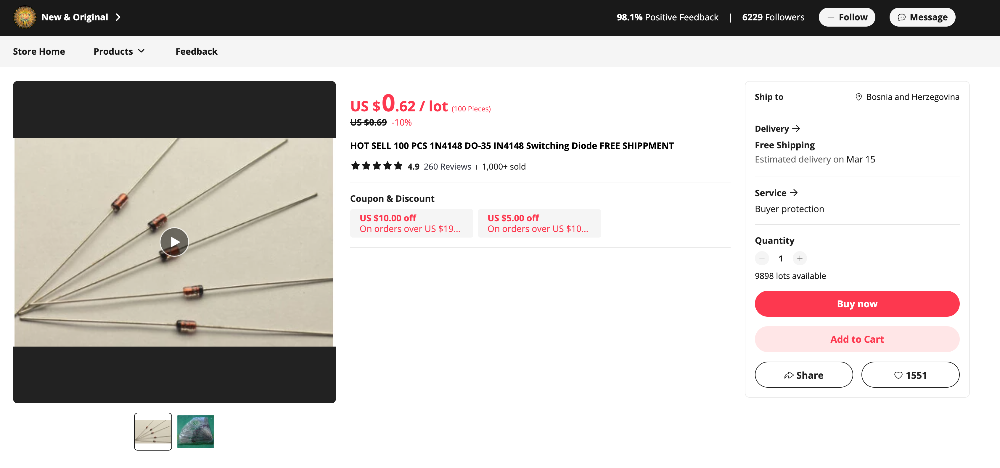
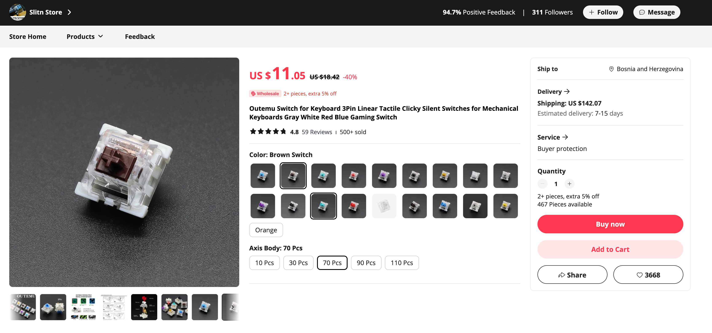

**NOTE: I used parts almost exclusively from Aliexpress but some can be found even cheaper on https://temu.com/**  

| Name                                                                                                                           | Link                                                  | Option                                                          | Price per unit | Shipping | Total units* | Total | Screenshot                                                                                                                                                              |
| ------------------------------------------------------------------------------------------------------------------------------ | ----------------------------------------------------- | --------------------------------------------------------------- | -------------- | -------- | ------------ | ----- | ----------------------------------------------------------------------------------------------------------------------------------------------------------------------- |
| Arduino Pro Micro ATmega32U4 5V/16MHz                                                                                          | https://www.aliexpress.com/item/32846843498.html      | Type-C                                                          | 3.51           | 0.28     | 2            | 7.58  |                                                                          |
| Copper Foil Tape                                                                                                               | https://www.aliexpress.com/item/1005004521941526.html | Width: 6mm, Length: 10m                                         | 0.99           | 0        | 1            | 0.99  |                                                                                                                  |
| (Option 1) NPKC DSA Blank Keycaps PBT Material for Gateron Kailh Cherry MX Switches                                            | https://www.aliexpress.com/item/32850729893.html      | 86pcs**                                                         | 26.28          | 0        | 1            | 26.28 |  |
| (Option 2) YMDK ZDA Ball Shape Thick PBT Matcha Blank and Dye-sublimation Keycap Set For Ergo Ergodox Lily58 Planck Preonic    | https://www.aliexpress.com/item/1005002723119555.html | Color: Full Blank                                               | 16.72          | 1.32     | 1            |    18.04   |                                                                                                                                                                         |
| Led Wire Cable 26AWG                                                                                                           | https://www.aliexpress.com/item/1005002906304265.html | Color: 6pin, Length: 5m                                         | 2.22           | 0        | 1            | 2.22  |                                                                                                          |
| ROUND 3 Core Braided Fabric Cable Lighting Lamp Flex Vintage - Choice of Colour                                                | https://www.ebay.com/itm/143258604111                 | Colour: any                                                     | 2.92           | 4.65     |         1     |    7.57   |                                                                                                                                                                         |
| 50g Solder Wire Tin 63/37 Rosin Core Tin                                                                                       | https://www.aliexpress.com/item/1005004015312619.html | Diameter: 50g 0.8mm                                             | 1.97           | 0.97     | 1            | 2.94  |                                                                    |
| 100 PCS 1N4148 diodes                                                                                                          | https://www.aliexpress.com/item/4001126137167.html    | default                                                         | 0.62           | 0        | 1            | 0.62  |                                                                                                        |
| Brass Heat Threaded Insert Nut and Screw Bolt Set                                                                              | https://www.aliexpress.com/item/1005005927555183.html | Size: Countersunk Head, M4x8x6 (20Set), Color: Countersunk head | 1.35           | 0        | 1            | 1.35  |                                                |
| Outemu Switch for Keyboard 3Pin                                                                                                | https://www.aliexpress.com/item/1005003770333961.html | Color: Brown switch, Axis Body: 70pcs                           | 11.05          | was 7.73 | 1            | 18.78 |                                                                                    |
| USB Type-C 4-Pin Cord Extension Connector                                                                                      | https://www.aliexpress.com/item/1005004982855996.html | Color: 25cm, Cable Length: 4pin Type-C Male                     | 1.28           | 0.51     | 2            | 3.79  |                                                                                            |
| USB Type-C 4-Pin Cord Extension Connector                                                                                      | https://www.aliexpress.com/item/1005004982855996.html | Color: 25cm, Cable Length: 4pin Type-C Female                   | 1.28           | 0.51     | 2            | 3.79  |                                                                                          |
| Tact Push Button Switch 12V Copper 2PIN DIP2 SMD Micro Switch 6X6X5 4.3 5 5.5 6 7 8 9 10 11 12 13 15MM TV Toys home use Button | https://www.aliexpress.com/item/1005006046180384.html | Color: 6X6X7MM<br>Size: 20PCS                                   | 1.06           | 0.81     | 1            | 1.87  |                                                                                                                            |
| 1Pcs GX16 2P/3/4/5/6/7/8 Pin Male & Female 16mm Circular Aviation Socket Plugs Wire Panel Connector GX-16 Aviation Plug        | https://www.aliexpress.com/item/4001141991815.html    | Color: 3 Pin Socket                                             | 1.08           | 0.42     | 2            | 3   |                                                                          |
| 1Pcs GX16 2P/3/4/5/6/7/8 Pin Male & Female 16mm Circular Aviation Socket Plugs Wire Panel Connector GX-16 Aviation Plug        | https://www.aliexpress.com/item/4001141991815.html    | Color: 3 Pin Plug<br>                                           | 1.08           | 0.42     | 2            |   3    |                                                                                                                                                                          |
| USB Type C cable (data transfer)***                                                                                           | https://www.aliexpress.com/item/1005006031337441.html | Color: Black-1.5m                                               | 1.39           | 0        | 1            | 1.39  |                                                                                      |
| Insulation Tape                                                                                                                | https://www.aliexpress.com/item/1005002795219371.html | Color: black                                                    | 1.79           | 0.86     | 1            | 2.65  |                                                                                                                    |
| **TOTAL: ~80-90 USD**                                                                                                          |                                                       |                                                                 |                |          |              |       |                                                                                                                                                                         |


*\*Total units that you will need to order from that specific AliExpress listing. It's not how many components you will need, it's how many to order!*     
*For example the AliExpress 1N4148 diode listing has a minimum quantity of 100, so the total units required for the keyboard is 1 and not 64.*

*\*\*Ordering keycaps is a bit different, you need to buy the amount you want and then send the seller a message with desired colors, sizes and amounts.*    
*For reference, this is how my message looked like:*
```
32 * 1u DSA11 Deep Purple
22 * 1u DSA12 Wathet
16 * 1u DSA3 Yellow
2 * 1.25u DSA11 Deep Purple
2 * 1.5u DSA11 Deep Purple
2 * 1.25u DSA16 Pink Mauve
2 * 1.5u DSA16 Pink Mauve
Total: 86
```

*\*\*\*This cable says that it has 4 wires (cores) but I didn't verify it. If you order it and the keyboard doesn't work but the Pro Micro is on, try any other USB Type C cable that has data transfer capabilities.*   
